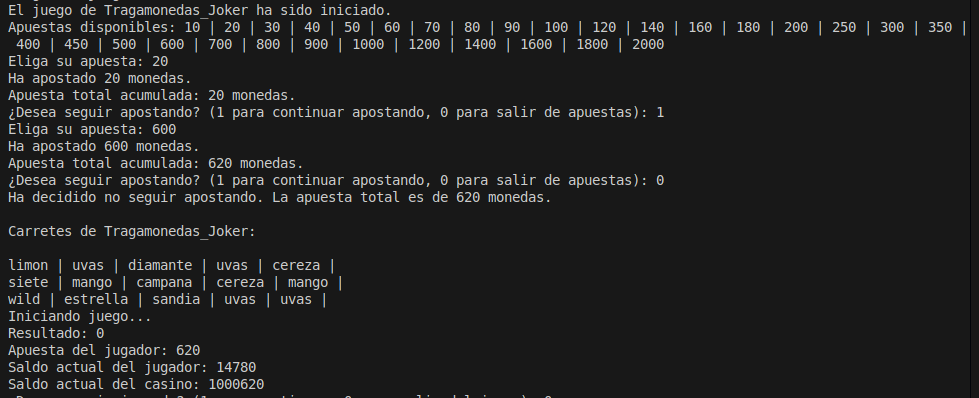
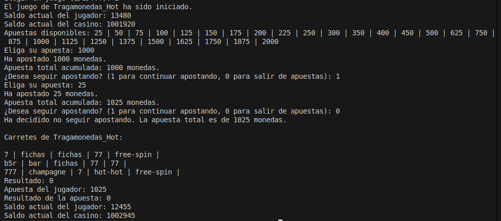
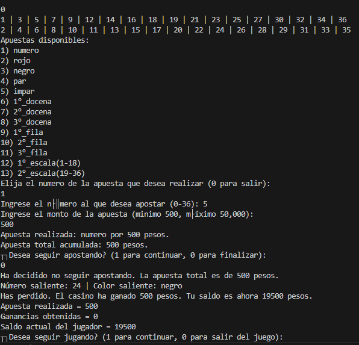
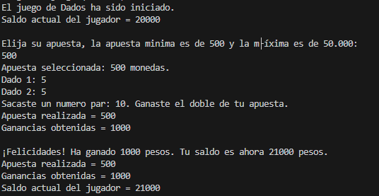
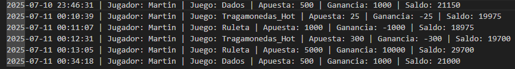
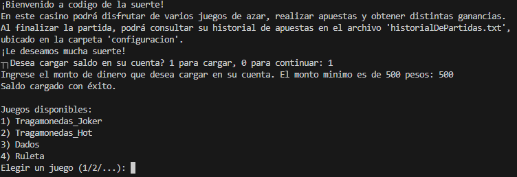

  <strong>💱 Código de la Suerte 💱</strong>

# Índice

1. [Descripción del Proyecto](#descripción-del-proyecto)  
2. [Características Principales](#información-general-del-casino)  
3. [Tutorial de Instalación](#tutorial-de-instalación)  
4. [Ejemplo de Uso](#ejemplo-de-uso)  
5. [Autores](#autores)

## Descripción del Proyecto

**Código de la Suerte** es el nombre de una aplicación de apuestas desarrollada en TypeScript que contiene varios juegos de azar, permitiendo al jugador apostar y visualizar un historial completo de sus partidas en un archivo de texto.  
El diseño de la aplicación se puede consultar en el [diagrama UML del sistema](https://drive.google.com/file/d/1awZ5sVCmyGnaeYdpk_ljBQwW-8561OHN/view?usp=drive_link).

## Información General del Casino

El casino contiene tres clases de juegos: **ruleta**, **tragamonedas** y **dados**.

- Existen dos variantes del tragamonedas diferenciándose únicamente por sus símbolos, sus combinaciones ganadoras, las ganancias de cada combinación, y la cantidad de apuestas permitidas. 
- El jugador tiene la posibilidad de consultar su historial de apuestas en un archivo de texto llamado `historialDePartidas.txt`.

## Descripción de los Juegos

### Tragamonedas

Este juego consiste en una máquina tragamonedas compuesta por varias filas y carretes (o ruedas) que giran verticalmente, distinguiéndose cada una de sus caras por los símbolos que representan.

Después de ingresar un monto de apuesta, el jugador activa la máquina mediante una palanca o botón, lo que hace girar los carretes un número determinado de veces. El objetivo es que, al detenerse, cada carrete muestre aleatoriamente una cara distinta en cada fila visible.

El objetivo final del jugador es lograr que los símbolos mostrados en los carretes formen una de las combinaciones ganadoras establecidas, lo que le permitirá incrementar sus ganancias.

#### Joker Joker

Joker Joker es una variante de tragamonedas compuesta por 3 filas y 5 carretes, en la que el jugador puede obtener combinaciones ganadoras alineando símbolos iguales en una misma fila, siempre de izquierda a derecha, comenzando desde el primer carrete.

**Tabla de Pagos (apuesta mínima $100):**

**Pagos Altos**

| Símbolo   | 5x     | 4x    | 3x   |
|-----------|--------|-------|------|
| Diamante  | $2000  | $500  | $100 |
| Siete     | $1000  | $300  | $60  |
| Bar       | $800   | $200  | $30  |
| Estrella  | $500   | $150  | $20  |
| Campana   | $500   | $150  | $20  |

**Pagos Bajos**

| Símbolo   | 5x   | 4x  | 3x    |
|-----------|------|-----|-------|
| Sandía    | $80  | $30 | $7.50 |
| Uvas      | $80  | $30 | $7.50 |
| Mango     | $80  | $30 | $7.50 |
| Durazno   | $50  | $20 | $5    |
| Limón     | $50  | $20 | $5    |
| Cereza    | $50  | $20 | $5    |

**Símbolo especial:** Wild – sustituye a todos los símbolos adyacentes.

#### Hot Hot

Hot Hot es una tragamonedas de 5 carretes y 3 filas que premia combinaciones de 3, 4 o 5 símbolos iguales en línea recta, tanto horizontal como verticalmente. Si aparecen 3 símbolos especiales “free-spin” en línea, se activan 3 tiradas gratuitas, durante las cuales se pueden volver a obtener más tiradas. Las ganancias se acumulan a lo largo de todas las rondas hasta finalizar, momento en el que se aplica el multiplicador de apuesta.

**Pagos Altos**

| Símbolo   | 5x     | 4x    | 3x   |
|-----------|--------|-------|------|
| 777       | $2000  | $1000 | $200 |
| 77        | $1000  | $400  | $100 |
| 7         | $400   | $200  | $50  |
| B5R       | $200   | $100  | $20  |
| BAR       | $100   | $50   | $10  |
| Scatter   | $100   | $30   | $10  |

**Pagos Bajos**

| Símbolo   | 5x  | 4x  | 3x  |
|-----------|-----|-----|-----|
| Champagne | $50 | $20 | $10 |
| Fichas    | $50 | $20 | $10 |

### Dados

  El juego consiste en lanzar dos dados. El valor total obtenido determina la ganancia del jugador según las siguientes reglas:

  - Si el resultado es un número **par**, el jugador gana **el doble** de su apuesta.
  - Si el resultado es un número **primo** (como 3, 5, 7, 11), el jugador gana **cinco veces** su apuesta.
  - Si el resultado es un número **impar no primo**, el jugador gana **el triple** de su apuesta.
  - En todos los casos, la ganancia se multiplica por el monto apostado.

---

### Ruleta

La ruleta es un juego donde el jugador puede apostar a diferentes opciones basadas en el resultado del giro de la ruleta (números del 0 al 36) y el color que salga.

El paño está dividido en números asociados a colores (rojo, negro y verde para el 0), además de categorías como par/impar, docenas, filas y escalas.

#### Tipos de Apuestas Disponibles

| Opción                | Descripción                                  |
|-----------------------|----------------------------------------------|
| Número                | Apostar a un número específico (0-36).      |
| Rojo                  | Apostar a que el número sea rojo.            |
| Negro                 | Apostar a que el número sea negro.           |
| Par                   | Apostar a que el número sea par (excluye 0).|
| Impar                 | Apostar a que el número sea impar (excluye 0).|
| 1° Docena             | Apostar a que salga un número entre 1 y 12. |
| 2° Docena             | Apostar a que salga un número entre 13 y 24.|
| 3° Docena             | Apostar a que salga un número entre 25 y 36.|
| 1° Fila               | Apostar a que el número pertenece a la fila 1 (números con residuo 1 módulo 3).|
| 2° Fila               | Apostar a que el número pertenece a la fila 2 (residuo 2 módulo 3).|
| 3° Fila               | Apostar a que el número pertenece a la fila 3 (múltiplos de 3, excluyendo 0).|
| 1° Escala (1-18)      | Apostar a que el número esté entre 1 y 18.  |
| 2° Escala (19-36)     | Apostar a que el número esté entre 19 y 36. |

#### Tabla de Pagos y Multiplicadores

| Tipo de Apuesta         | Multiplicador (x) | Explicación                                           |
|------------------------|-------------------|------------------------------------------------------|
| Número (acierto exacto) | 36                | Ganas 36 veces lo apostado si el número es exacto.  |
| Docenas y Filas        | 3                 | Ganas 3 veces lo apostado si el número está en la docena o fila elegida. |
| Colores, Par/Impar, Escalas | 2               | Ganas 2 veces lo apostado si aciertas en color, par/impar o escala. |

#### Ejemplos de ganancias

- Si apuestas $500 al número 7 y sale 7, ganas $18,000 (500 × 36).  
- Si apuestas $1000 al color rojo y sale un número rojo, ganas $2000 (1000 × 2).  
- Si apuestas $2000 a la 1° docena y sale un número entre 1 y 12, ganas $6000 (2000 × 3).  

---

### Dinámica del Juego

- El jugador puede cambiar de juego sin reiniciar la aplicación.  
- Si el saldo llega a $0, no puede seguir apostando.  
- Los juegos validan y modifican el saldo automáticamente.  

## Ejemplo de uso

### Tragamonedas

#### Joker Joker

  

#### Hot Hot

  

### Ruleta

  

### Dados

  

### Historial de Jugadas

Cada vez que el jugador completa una ronda en cualquiera de los juegos, la aplicación guarda un registro detallado de la jugada en un archivo de texto llamado `historialDePartidas.txt`.

  

---

## Vista General de la Aplicación

- **`Mensaje de Inicio y Operaciones Disponibles`**

  

---

## Tutorial de Instalación

1. Tener instalado y abrir **Visual Studio Code**.  
2. Instalar en el IDE:  
   - Node.js (versión recomendada: `16.x` o superior)  
   - TypeScript (`npm install -g typescript`)  
3. Clonar o descargar este repositorio en el escritorio.  
4. Abrir una terminal en la raíz del proyecto (`cd tpCasino`) y luego (`cd casino`).  
5. Ejecutar para compilar:
       tsc Ejecutable.ts
7. Luego, iniciar la aplicación:
       node Ejecutable.js

## Autores
Proyecto desarrollado por:
- **Martín Lorenzi** – [alexmartin9c@gmail.com](mailto:alexmartin9c@gmail.com) 
